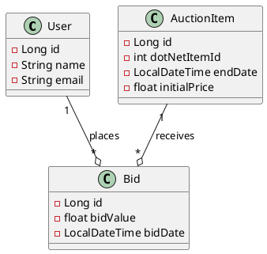
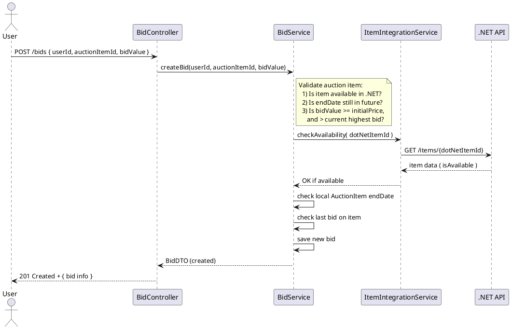

# Project Documentation: Spring Boot Auction API

This document presents a high-level **project documentation** and **user stories** for a **Spring Boot** application that manages auctions. This application will integrate with the **.NET** backend to check if an item is available (via `isAvailable` flag). The code and naming conventions will be in **English**, and we’ll include **UML** (class diagram and sequence diagram) in **PlantUML** format.

---

## 1. Overview

**Goal**: Build a **REST API** in Spring Boot that:
- Manages **users**.
- Manages **auction items** (local entity) referencing items from the **.NET** API.
- Manages **bids** (licitations) which must be greater than the previous one and cannot exceed the end date.
- Consumes the **.NET** API to verify if an item is available (checking `isAvailable` flag there).
- Ends automatically at `endDate` or can be ended manually.

**Key Entities**:
1. **User**: Has `id`, `name`, `email`.
2. **AuctionItem**: Has `id`, `dotNetItemId`, `endDate`, and `initialPrice`.
3. **Bid**: Has `id`, `bidValue`, `bidDate`, references a `User` and an `AuctionItem`.

---

## 2. User Stories

Below are the main user stories reflecting the new requirements:

### 2.1 Users
1. **User Story #1: Create a User**
   - **As** a new visitor,
   - **I want** to register a new user (with name and email),
   - **So that** I can place bids in auctions.

2. **User Story #2: Update User**
   - **As** a logged-in user,
   - **I want** to update my personal information (email, name),
   - **So that** my profile is always accurate.

3. **User Story #3: List Users**
   - **As** an admin,
   - **I want** to view a list of all users,
   - **So that** I can have control over the system.

*(Optionally, you can have `DELETE /users/{id}` to remove a user if it’s part of your domain logic.)*

### 2.2 Auction Items
1. **User Story #4: Register an Auction Item**
   - **As** an admin,
   - **I want** to create a local record of an auction item, providing `dotNetItemId`, `endDate`, and `initialPrice`,
   - **So that** I can open an auction referencing an existing item on .NET.

2. **User Story #5: Check Item Availability**
   - **As** the system,
   - **I want** to call the .NET API to verify that an item (`dotNetItemId`) is still available (i.e., `isAvailable == true`),
   - **So that** I can prevent creating or continuing an auction for an unavailable item.

3. **User Story #6: List Auction Items**
   - **As** any user,
   - **I want** to see all auction items with end dates and initial prices,
   - **So that** I can decide which auctions to bid on.

### 2.3 Bids
1. **User Story #7: Place a Bid**
   - **As** a logged-in user,
   - **I want** to place a bid on an auction item,
   - **So that** I can compete to win the item.
   - **Criteria**:
     - Bid must be greater than the previous highest bid.
     - Bid must be greater than or equal to the `initialPrice` if it’s the first bid.
     - `endDate` must not be passed.

2. **User Story #8: View Bids of an Item**
   - **As** a user,
   - **I want** to list all bids of a specific auction item,
   - **So that** I can see the competition.

3. **User Story #9: End Auction Manually**
   - **As** an admin,
   - **I want** to end an auction item before its `endDate`,
   - **So that** I can force the auction to close for special reasons.

4. **User Story #10: Automatic End**
   - **As** the system,
   - **I want** to disallow new bids after `endDate` is reached,
   - **So that** no user can bid on an expired auction.

---

## 3. UML Diagrams

### 3.1 Class Diagram (PlantUML)

**Explanation**:
1. **User**: Basic entity with `id, name, email`.
2. **AuctionItem**: References `dotNetItemId`, plus `endDate` and `initialPrice`.
3. **Bid**: Has `bidValue, bidDate`, belongs to one **User** and one **AuctionItem**.

### 3.2 Sequence Diagram (PlantUML) - Placing a Bid

---

## 4. Next Steps

1. **Design Entities** in Spring Boot:
   - `User` (id, name, email)
   - `AuctionItem` (id, dotNetItemId, endDate, initialPrice)
   - `Bid` (id, bidValue, bidDate, references `User` and `AuctionItem`)

2. **Controllers**:
   - `UserController`: CRUD for users
   - `AuctionItemController`: create, list, manually end an auction item
   - `BidController`: place bids, list bids

3. **Integration**:
   - `ItemIntegrationService`: uses `RestTemplate` or `WebClient` to call .NET: `GET /items/{dotNetItemId}`.
   - Ensures `isAvailable` is true before letting the user create an `AuctionItem` or place a new bid.

4. **Validation**:
   - Ensure `bidValue` > previous bid, `bidValue` >= `initialPrice`.
   - Ensure current time < `endDate` for auto-closing.

5. **Testing**:
   - Use Postman / unit tests to confirm each user story.
   - Possibly add a scheduled task or filter that checks if endDate has passed.

---

## 5. Conclusion

With these user stories, UML diagrams, and next steps, you have a solid **project documentation** to implement a **Spring Boot** auction system that **integrates** with a .NET backend for item availability. Focus on clear separation of concerns (controllers, services, integration service) and robust validations for the bidding rules.

